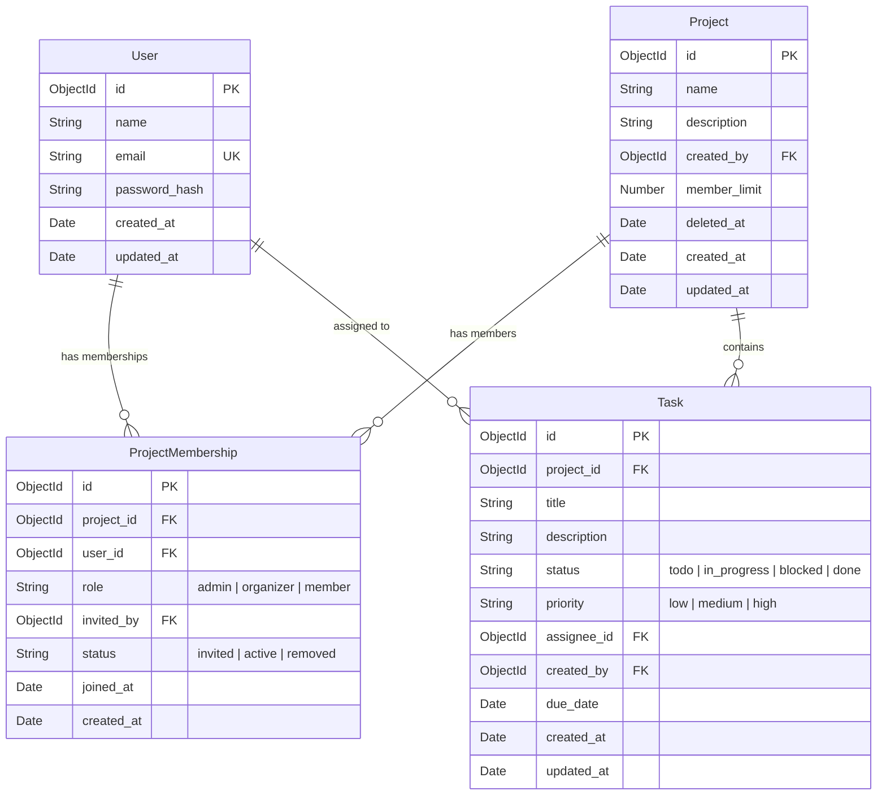

# TaskFlow — Backend Architecture

## Folder Structure

```
backend/
├── config/
│   └── db.js              # Mongoose connection setup
├── controllers/           # Route handlers (business logic)
├── middleware/             # Auth, role-checking, validation helpers
├── models/
│   ├── User.js            # Account credentials and profile
│   ├── Project.js         # Top-level container for tasks
│   ├── ProjectMembership.js  # Per-project roles (join table)
│   └── Task.js            # The core object of the app
├── routes/                # Express router definitions
├── server.js              # App entry point, middleware stack, error handler
├── .env.example           # Required environment variables
└── ARCHITECTURE.md        # This file
```

## Why Role Is Resolved Per-Request

The JWT carries only `user_id`, `iat`, and `exp` — **never** a project role.

Role lives in `ProjectMembership` and is looked up fresh on every request that touches a project. This design costs one extra DB read per request but buys three things:

1. **Immediate effect** — when an admin demotes a user, the change takes effect on the very next request. There is no stale token granting access the user no longer has.
2. **Per-project scoping** — the same user can be an admin on Project A and a plain member on Project B. Embedding a single role in the JWT would flatten this.
3. **Simpler token management** — no need to revoke or rotate tokens when roles change. The token is an identity assertion, not a permission grant.

## Entity Relationships

Four models, three relationships:

- A **User** can belong to many **Projects** through **ProjectMembership**.
- A **Project** has many **Tasks** and many **Members** (via ProjectMembership).
- A **Task** belongs to exactly one **Project** and is assigned to exactly one **User** (the assignee must be an active member of that project).
- **ProjectMembership** is the join table — each record ties one User to one Project with a specific role. A compound unique index on `(project_id, user_id)` prevents duplicates.


